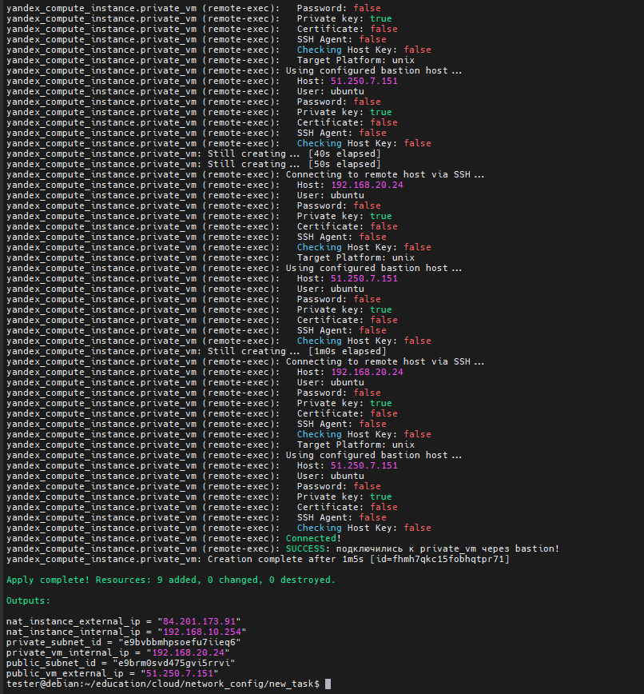
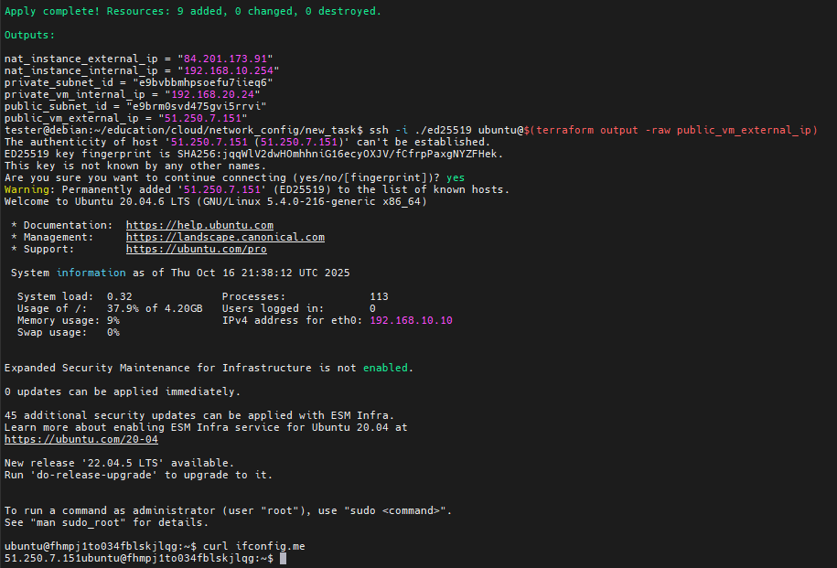
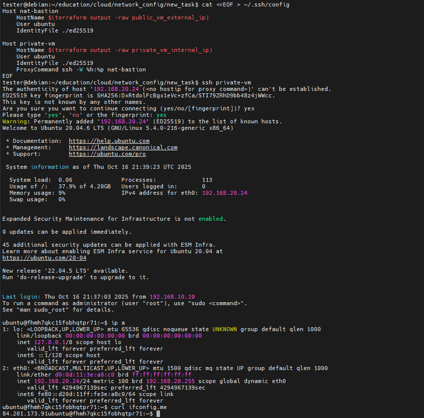

# Домашнее задание к занятию «Организация сети»

## Описание заданий

https://github.com/netology-code/clopro-homeworks/blob/main/15.1.md

### Подготовка к выполнению задания

1. Домашнее задание состоит из обязательной части, которую нужно выполнить на провайдере Yandex Cloud, и дополнительной части в AWS (выполняется по желанию). 
2. Все домашние задания в блоке 15 связаны друг с другом и в конце представляют пример законченной инфраструктуры.  
3. Все задания нужно выполнить с помощью Terraform. Результатом выполненного домашнего задания будет код в репозитории. 
4. Перед началом работы настройте доступ к облачным ресурсам из Terraform, используя материалы прошлых лекций и домашнее задание по теме «Облачные провайдеры и синтаксис Terraform». Заранее выберите регион (в случае AWS) и зону.

---
### Задание 1. Yandex Cloud 

**Что нужно сделать**

1. Создать пустую VPC. Выбрать зону.
2. Публичная подсеть.

 - Создать в VPC subnet с названием public, сетью 192.168.10.0/24.
 - Создать в этой подсети NAT-инстанс, присвоив ему адрес 192.168.10.254. В качестве image_id использовать fd80mrhj8fl2oe87o4e1.
 - Создать в этой публичной подсети виртуалку с публичным IP, подключиться к ней и убедиться, что есть доступ к интернету.
3. Приватная подсеть.
 - Создать в VPC subnet с названием private, сетью 192.168.20.0/24.
 - Создать route table. Добавить статический маршрут, направляющий весь исходящий трафик private сети в NAT-инстанс.
 - Создать в этой приватной подсети виртуалку с внутренним IP, подключиться к ней через виртуалку, созданную ранее, и убедиться, что есть доступ к интернету.

Resource Terraform для Yandex Cloud:

- [VPC subnet](https://registry.terraform.io/providers/yandex-cloud/yandex/latest/docs/resources/vpc_subnet).
- [Route table](https://registry.terraform.io/providers/yandex-cloud/yandex/latest/docs/resources/vpc_route_table).
- [Compute Instance](https://registry.terraform.io/providers/yandex-cloud/yandex/latest/docs/resources/compute_instance).

---
### Задание 2. AWS* (задание со звёздочкой)

Это необязательное задание. Его выполнение не влияет на получение зачёта по домашней работе.

**Что нужно сделать**

1. Создать пустую VPC с подсетью 10.10.0.0/16.
2. Публичная подсеть.

 - Создать в VPC subnet с названием public, сетью 10.10.1.0/24.
 - Разрешить в этой subnet присвоение public IP по-умолчанию.
 - Создать Internet gateway.
 - Добавить в таблицу маршрутизации маршрут, направляющий весь исходящий трафик в Internet gateway.
 - Создать security group с разрешающими правилами на SSH и ICMP. Привязать эту security group на все, создаваемые в этом ДЗ, виртуалки.
 - Создать в этой подсети виртуалку и убедиться, что инстанс имеет публичный IP. Подключиться к ней, убедиться, что есть доступ к интернету.
 - Добавить NAT gateway в public subnet.
3. Приватная подсеть.
 - Создать в VPC subnet с названием private, сетью 10.10.2.0/24.
 - Создать отдельную таблицу маршрутизации и привязать её к private подсети.
 - Добавить Route, направляющий весь исходящий трафик private сети в NAT.
 - Создать виртуалку в приватной сети.
 - Подключиться к ней по SSH по приватному IP через виртуалку, созданную ранее в публичной подсети, и убедиться, что с виртуалки есть выход в интернет.

Resource Terraform:

1. [VPC](https://registry.terraform.io/providers/hashicorp/aws/latest/docs/resources/vpc).
2. [Subnet](https://registry.terraform.io/providers/hashicorp/aws/latest/docs/resources/subnet).
3. [Internet Gateway](https://registry.terraform.io/providers/hashicorp/aws/latest/docs/resources/internet_gateway).
---

## Выполнение заданий

### Решение 1

Готовим окружение (результаты в [src](./src/))
```
https://github.com/Spardoks/Terraform.-Yandex-Cloud
https://github.com/Spardoks/TerraformIntro
# Terraform v1.11.4
# debian 12
```

Разворачиваем инфраструктуру
```
ssh-keygen -t ed25519 -f ./ed25519 -N ""
yc config profile activate sa-profile
export YC_TOKEN=$(yc iam create-token)
export YC_CLOUD_ID=$(yc config get cloud-id)
export YC_FOLDER_ID=$(yc config get folder-id)
cp .terraformrc ~/.terraformrc
cat > personal.auto.tfvars << EOF
token        = "${YC_TOKEN}"
cloud_id     = "${YC_CLOUD_ID}"
folder_id    = "${YC_FOLDER_ID}"
EOF
terraform init
terraform validate
terraform plan
terraform apply
```


Проверяем доступность
```
ssh -i ./ed25519 ubuntu@$(terraform output -raw public_vm_external_ip)

cat <<EOF > ~/.ssh/config
Host nat-bastion
    HostName $(terraform output -raw public_vm_external_ip)
    User ubuntu
    IdentityFile ./ed25519

Host private-vm
    HostName $(terraform output -raw private_vm_internal_ip)
    User ubuntu
    IdentityFile ./ed25519
    ProxyCommand ssh -W %h:%p nat-bastion
EOF

ssh private-vm

curl ifconfig.me
```




Чистим всё
```
terraform destroy
rm -rf ~/.ssh/config
```
